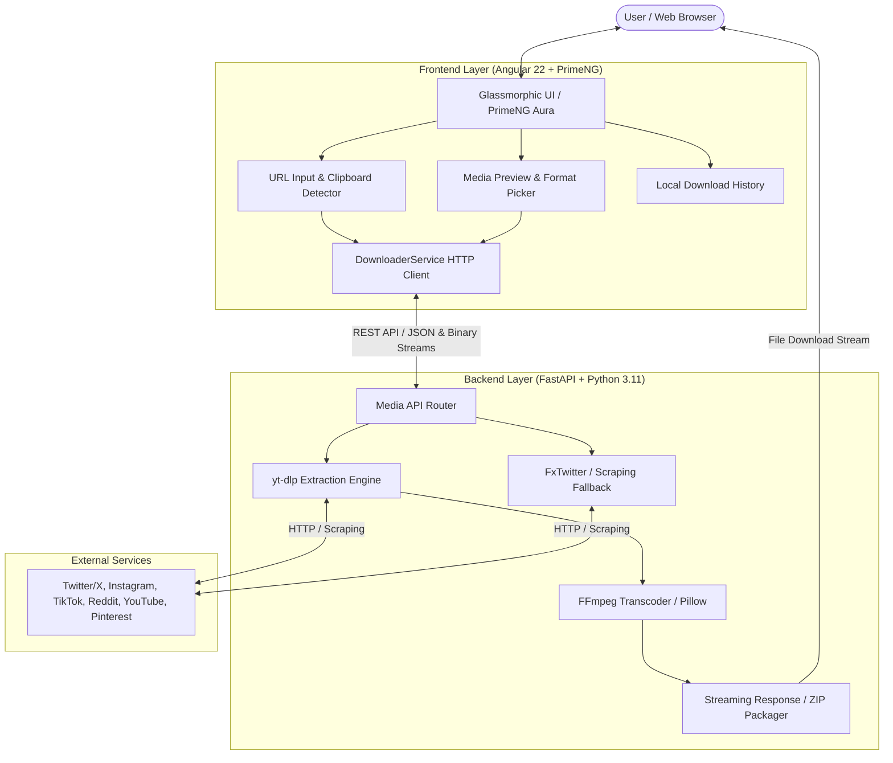
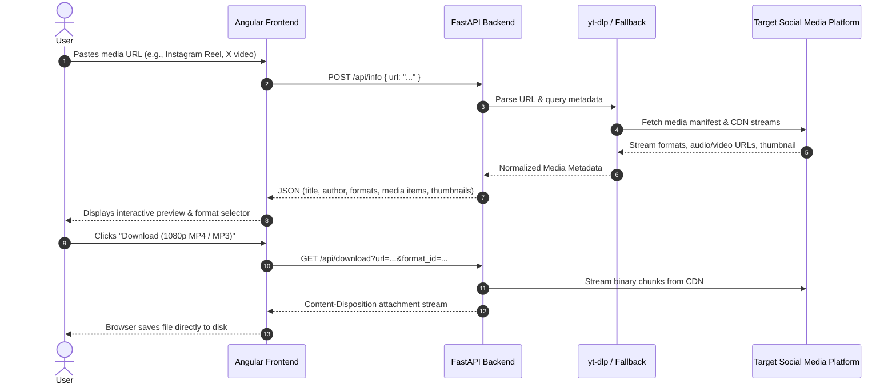

# OmniGrab — Social Media Downloader
## Comprehensive Project Documentation & Technical Specification

---

## 1. Executive Summary

**OmniGrab** (also known as *BKN Social Platform Downloader*) is an end-to-end full-stack web application engineered to parse, extract, and download high-definition media (videos, audio tracks, single photos, and multi-image carousels) from top social media networks without requiring user logins or third-party paid APIs.

The system features an **Angular 22** client designed with modern glassmorphism aesthetics powered by **PrimeNG 22**, coupled with an asynchronous **Python FastAPI** backend powered by **yt-dlp**, **FFmpeg**, and fallback scraping engines.

---

## 2. Project Architecture

### 2.1 High-Level Architecture Diagram



### 2.2 Sequence Diagram: Extraction & Download Flow



---

## 3. Technology Stack & Dependencies

### 3.1 Frontend Stack

| Component | Technology | Version | Purpose |
|---|---|---|---|
| Framework | **Angular** | 22.x | Single Page Application framework with standalone components |
| UI Component Library | **PrimeNG** | 22.x | High-quality UI controls (buttons, inputs, dialogs, drawers) |
| Styling Theme | **PrimeUIX Aura** + SCSS | 3.x | Dark mode glassmorphism design system |
| Icon Library | **PrimeIcons** | 8.x | Vector icon suite |
| HTTP Client & State | **RxJS** | ~7.8.0 | Asynchronous stream handling and HTTP operations |
| Language | **TypeScript** | ~6.0.2 | Typed development environment |

### 3.2 Backend Stack

| Component | Technology | Version | Purpose |
|---|---|---|---|
| Web Framework | **FastAPI** | >=0.115.0 | High-performance asynchronous Python API |
| ASGI Web Server | **Uvicorn** | >=0.30.0 | Lightning-fast ASGI production server |
| Extraction Core | **yt-dlp** | >=2025.1.0 | Universal media extraction and format parsing engine |
| Media Transcoding | **imageio-ffmpeg** / FFmpeg | >=0.5.1 | Audio extraction (MP3) and video container remuxing |
| Image Processing | **Pillow** | >=10.0.0 | Image conversion, carousel processing, and thumbnail handling |
| Schema Validation | **Pydantic v2** | >=2.7.0 | Strict request/response validation and serialization |
| Async File I/O | **aiofiles** | >=24.1.0 | Non-blocking file writes for temporary downloads |

---

## 4. Supported Platforms & Capabilities

| Platform | Supported Media Types | Extraction Method | Max Resolution |
|---|---|---|---|
| **Twitter / X** | Videos, GIFs, Single Images, Multi-Image Posts | `yt-dlp` with FxTwitter API fallback | Up to 1080p |
| **Instagram** | Reels, Video Posts, Photos, Multi-Photo Carousels | `yt-dlp` + direct CDN stream extraction | Up to 1080p HD |
| **Threads** | Photos, Videos, Text+Media posts | `yt-dlp` / OpenGraph parser | Original upload quality |
| **TikTok** | Watermark-free Videos, Audio Tracks | `yt-dlp` TikTok extractor | 1080p / Original MP4 |
| **YouTube Shorts** | Vertical Videos, Audio (MP3) | `yt-dlp` YouTube extractor | 1080p / 720p / MP3 Audio |
| **Reddit** | Videos with synced audio, GIFs, Images | `yt-dlp` Reddit muxer | Source quality |
| **Pinterest** | Video Pins, High-Res Image Pins | `yt-dlp` + direct image fallback | Original resolution |

---

## 5. API Reference & Specifications

### 5.1 `GET /api/platforms`
Returns the list of supported social networks, brand colors, and URL regex patterns.

- **Response `200 OK`**:
```json
[
  {
    "id": "twitter",
    "name": "Twitter / X",
    "icon": "pi-twitter",
    "supported_types": ["video", "image", "carousel"]
  },
  {
    "id": "instagram",
    "name": "Instagram",
    "icon": "pi-instagram",
    "supported_types": ["video", "image", "carousel"]
  }
]
```

### 5.2 `POST /api/info`
Parses any social media link and returns structured metadata, thumbnails, and available download formats.

- **Request Body**:
```json
{
  "url": "https://www.instagram.com/reel/Cxxxxxx/"
}
```

- **Response `200 OK`**:
```json
{
  "platform": "instagram",
  "title": "Amazing Sunset Reel",
  "uploader": "nature_photographer",
  "thumbnail": "https://scontent...cdninstagram.com/...",
  "duration": 28,
  "media_type": "video",
  "formats": [
    {
      "format_id": "best",
      "resolution": "1080p (Full HD)",
      "extension": "mp4",
      "filesize_approx": "12.4 MB"
    },
    {
      "format_id": "audio",
      "resolution": "Audio Only",
      "extension": "mp3",
      "filesize_approx": "1.2 MB"
    }
  ]
}
```

### 5.3 `GET /api/download`
Streams media directly to the user's browser, forcing a file download dialogue (`Content-Disposition: attachment`).

- **Query Parameters**:
  - `url` (*string*, required): Target social media URL.
  - `format_id` (*string*, optional): Format identifier returned from `/api/info`.
  - `title` (*string*, optional): Custom filename for the output file.

### 5.4 `POST /api/batch-download`
Bundles multiple images or videos (e.g. multi-photo Instagram carousel or Twitter thread) into a single `.zip` file on-the-fly and streams it to the user.

---

## 6. Frontend Component Architecture

1. **`NavbarComponent`** (`frontend/src/app/components/navbar/`):
   - Branding logo, real-time backend health badge, supported platform quick-filter badges, and GitHub link.
2. **`UrlInputComponent`** (`frontend/src/app/components/url-input/`):
   - Hero input bar with instant clipboard reading (`navigator.clipboard.readText()`).
   - Real-time platform badge detection based on input regex.
3. **`MediaPreviewComponent`** (`frontend/src/app/components/media-preview/`):
   - In-app responsive HTML5 video player and image carousel preview.
   - Format cards (1080p, 720p, 480p, MP3) with direct download action buttons.
4. **`HistoryComponent`** (`frontend/src/app/components/history/`):
   - Drawer component displaying previous downloads stored in `localStorage`.
   - Allows one-click re-downloading or clearing history.
5. **`FaqComponent`** (`frontend/src/app/components/faq/`):
   - Step-by-step accordion guide explaining how to copy links across Android, iOS, and Desktop apps.

---

## 7. Installation, Setup & Running

### 7.1 Prerequisites
- **Python**: 3.10+ (Python 3.11 recommended)
- **Node.js**: 20+ (Node v26 tested)
- **FFmpeg**: Handled automatically via `imageio-ffmpeg` or system FFmpeg

### 7.2 Running Locally (Quick Start)
Execute the batch script in the root directory:
```bat
start.bat
```
This automatically launches:
- **Backend**: `http://127.0.0.1:8000`
- **Frontend**: `http://localhost:4200`
- **Swagger Docs**: `http://127.0.0.1:8000/docs`

---

## 8. Deployment Options

### 8.1 Docker & Docker Compose
A multi-stage [Dockerfile](file:///d:/Project/old/mediaproject/Dockerfile) and [docker-compose.yml](file:///d:/Project/old/mediaproject/docker-compose.yml) are included:
```bash
docker compose up -d --build
```
The unified container compiles the Angular frontend to static production files, installs system `ffmpeg` & Python requirements, and serves both via FastAPI on port `8000`.

### 8.2 Render.com (Free Cloud Hosting)
Configured with [render.yaml](file:///d:/Project/old/mediaproject/render.yaml) blueprint:
1. Connect repository `https://github.com/BalakumaranBKN/socialMediaDownloader`.
2. Select Blueprint deployment; Render builds and launches the web service automatically.
